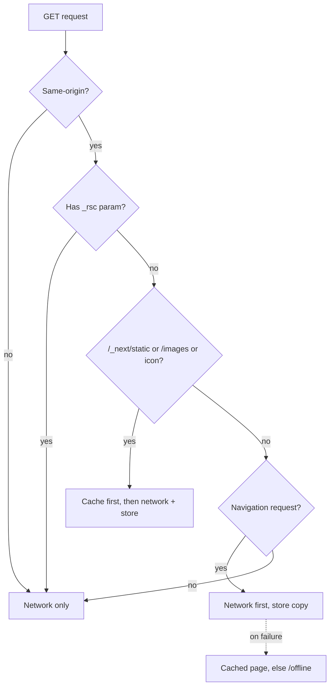

# PWA conversion for Le Bellagio

## Starting point

Most of the manifest work is already done. [public/site.webmanifest](public/site.webmanifest) has `display: standalone`, `scope`, `id`, 192/512 icons with `any` + `maskable`, and theme/background colors, and [app/layout.tsx](app/layout.tsx) already links it through `metadata.manifest` and sets `themeColor` in `viewport`.

What is missing:

- No service worker, so there is no offline behavior and Chrome/Android will never fire the install prompt (it requires an active SW with a `fetch` handler).
- No install UI and no iOS "Add to Home Screen" hint.
- No `apple-mobile-web-app-*` metadata, so iOS opens the installed icon in a Safari chrome instead of standalone.
- The bottom [components/mobile-action-bar.tsx](components/mobile-action-bar.tsx) has no safe-area inset and no active-tab state, which is very visible once the app runs standalone on a notched phone.

## Caching strategy

Deliberately conservative, because App Router serves RSC payloads that must never be served stale from a different build.

## Files to create

### `public/sw.js`

Plain JS, no build step, served from the root so its scope is `/`.

- `const VERSION = "v1"` and cache names `lb-precache-${VERSION}` / `lb-runtime-${VERSION}`. Bumping `VERSION` is the release mechanism.
- `install`: precache only build-independent assets — `/offline`, `/logo.svg`, `/favicon.svg`, the two `web-app-manifest-*.png`, `/apple-touch-icon.png`, `/site.webmanifest`, `/menu.pdf`, and the files in `public/images/`. Then `self.skipWaiting()`.
- `activate`: delete caches whose name does not match the current `VERSION`, then `self.clients.claim()`.
- `fetch`: bail out early on `request.method !== "GET"`, on cross-origin URLs, and on `url.searchParams.has("_rsc")`. Then apply the strategies in the diagram above. Runtime cache writes go to `lb-runtime-*`; guard every `cache.put` behind a `response.ok && response.type !== "opaque"` check.

### `app/offline/page.tsx`

Static server component reusing `PageShell`-less minimal chrome (logo, "Vous êtes hors ligne" message, phone link from `RESTAURANT.phoneRaw`, and a retry button). Keep it out of [app/sitemap.ts](app/sitemap.ts) (that file is an explicit list, so no edit needed) and add `disallow: ["/offline"]` in [app/robots.ts](app/robots.ts).

### `components/pwa/service-worker-register.tsx`

`"use client"`, renders `null`. In a `useEffect`, register `/sw.js` only when `process.env.NODE_ENV === "production"` and `"serviceWorker" in navigator`, so `pnpm dev` is never poisoned by a stale cache.

### `components/pwa/install-prompt.tsx`

`"use client"`, mirroring the structure and styling of [components/cookie-banner.tsx](components/cookie-banner.tsx) (fixed bottom card, `Button` from `components/ui/button`, `X` dismiss, `localStorage` under `lb_pwa_install`).

- Listen for `beforeinstallprompt`, `preventDefault()` it, stash the event, and call `prompt()` from the install button.
- On iOS Safari (no `beforeinstallprompt`), detect via user agent and show a Share-icon hint instead of an install button.
- Render nothing when already installed: `window.matchMedia("(display-mode: standalone)").matches || (navigator as any).standalone`.
- To avoid two stacked bottom dialogs, only render once `lb_cookie_consent` is present in `localStorage`.

## Files to edit

- [public/site.webmanifest](public/site.webmanifest) — add `display_override: ["standalone", "minimal-ui"]`, `orientation: "portrait"`, `dir: "ltr"`, `categories: ["food", "lifestyle"]`, and `shortcuts` for `/menu`, `/reservation`, `/order`. Optionally `screenshots` later, once real captures exist.
- [app/layout.tsx](app/layout.tsx) — add `appleWebApp: { capable: true, statusBarStyle: "default", title: "Bellagio" }` and `applicationName` to `metadata`; add `viewportFit: "cover"` to the exported `viewport`; mount `<ServiceWorkerRegister />` and `<InstallPrompt />` inside `LocaleProvider` next to `<CookieBanner />`.
- [components/mobile-action-bar.tsx](components/mobile-action-bar.tsx) — add `pb-[env(safe-area-inset-bottom)]` to the `nav`, and derive an active state from `usePathname()` so the current tab renders in `text-primary`.
- [components/page-shell.tsx](components/page-shell.tsx) — the `main` currently uses a flat `pb-16 md:pb-0`; change to `pb-[calc(4rem+env(safe-area-inset-bottom))]` so content is not hidden behind the taller inset bar.
- [app/globals.css](app/globals.css) — add `overscroll-behavior-y: none` on `body` so standalone mode does not rubber-band, and a `@media (display-mode: standalone)` block to suppress the address-bar-era top padding if any is needed.
- [next.config.mjs](next.config.mjs) — add a `headers()` entry for `/sw.js` sending `Cache-Control: no-cache, no-store, must-revalidate` and `Service-Worker-Allowed: /`, so an updated worker is always picked up.
- [lib/i18n.ts](lib/i18n.ts) — add `pwa_install_text`, `pwa_install_cta`, `pwa_install_ios_hint`, `pwa_later`, `offline_heading`, `offline_text`, `offline_retry` to **both** the `fr` and `en` maps.
- [AGENT.md](AGENT.md) and [README.md](README.md) — document the service worker, the `VERSION` bump requirement, and the fact that the SW is production-only.

## Verification

1. `pnpm exec tsc --noEmit` — the real type check, since `next.config.mjs` sets `ignoreBuildErrors`.
2. `pnpm build && pnpm start`, then in DevTools → Application: confirm the manifest parses with no warnings, the worker is activated, and "Install" is offered.
3. Toggle Network → Offline and reload `/`, `/menu`, and an unvisited route to confirm the cached pages and the `/offline` fallback both behave.
4. Bump `VERSION` in `public/sw.js`, reload twice, and confirm old caches are gone.
